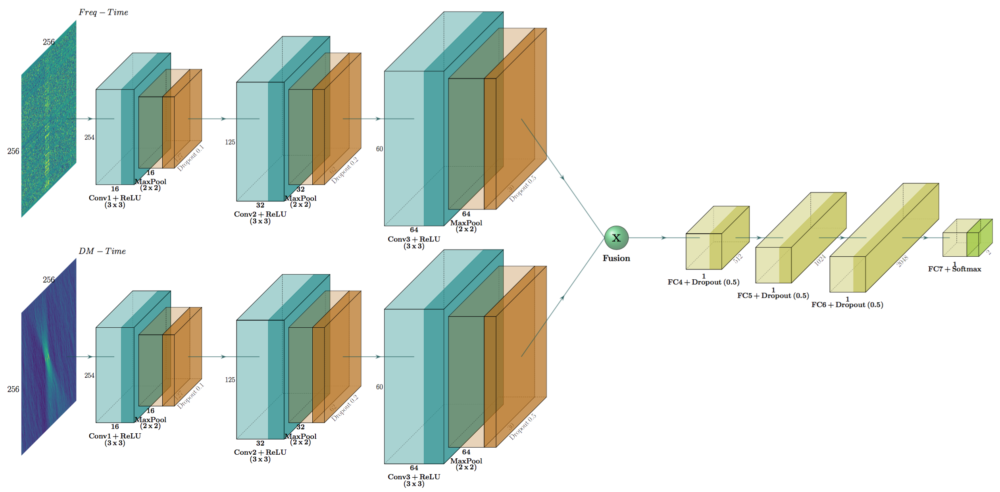

# Multi-Input FRBID - MeerKAT Fast Radio Burst Intelligent Distinguisher using Deep Learning

Identification of Fast Radio Burst/Single Pulses (FRB/SP) and Radio Frequency Interference (RFI) using Deep Convolutional Neural Network for MeerKAT facility. The code uses two inputs: the DM-Time and Frequency-Time images/arrays. Each image acts as an input to a CNN. At the end both DM-T CNN and Freq-T CNN are fused and pass through dense layers as shown in the figure below.

Installation
---
Follow the instructions in Installation.txt to install all dependencies.

Training and Prediction
---
To train the model from scratch, either use `FRBID - DEMO - MULTIINPUT.ipynb` or `train.py`. Note that there are several parameters that need to be changed if one want different configuration, else run the code as follows:

        python train.py
        or run all cells in FRBID - DEMO - MULTIINPUT.ipynb

To make prediction on new candidates that do not have a label, use either `FRBID - prediction-phase.ipynb` or `predict.py`. Note that a directory containing all `h5` candidate files should be available and some parameters need to be specified, for e.g the model_name, the directory to save the csv file containing the prediction, the directory of the `h5` files and the threshold probability.

Run prediction on new candidate files as follows:

        python predict.py -d ./data/test_set/ -r ./data/results_csv/ -p 0.5              
or run prediction on default settings as follows:
        
        python predict.py
        or run all cells in FRBID - prediction-phase.ipynb

 
